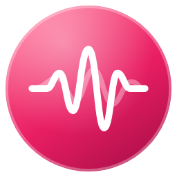
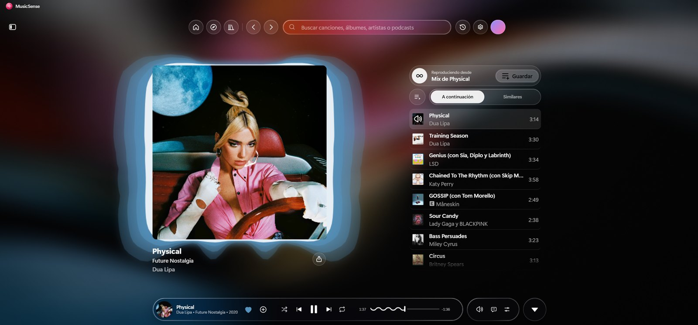
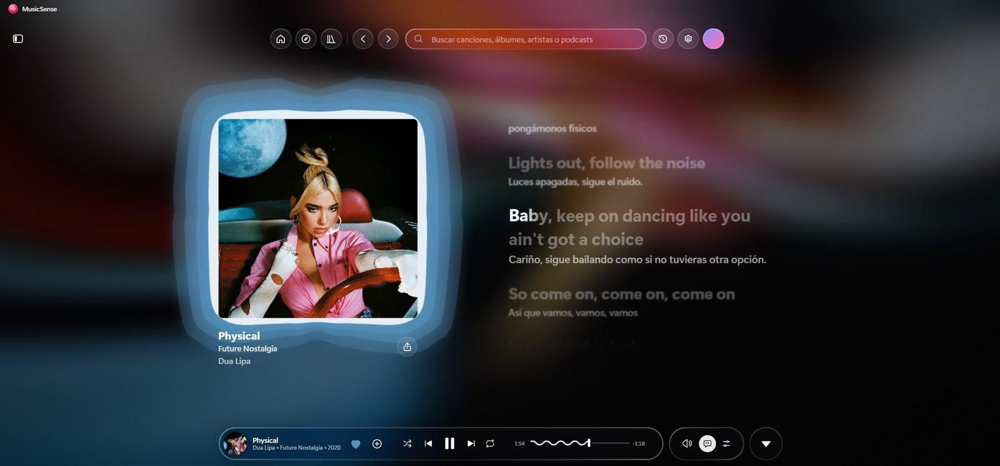
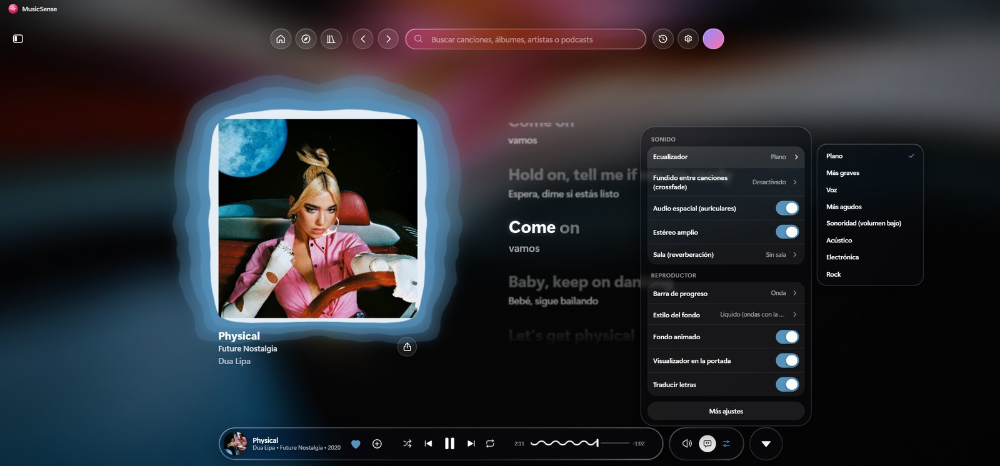
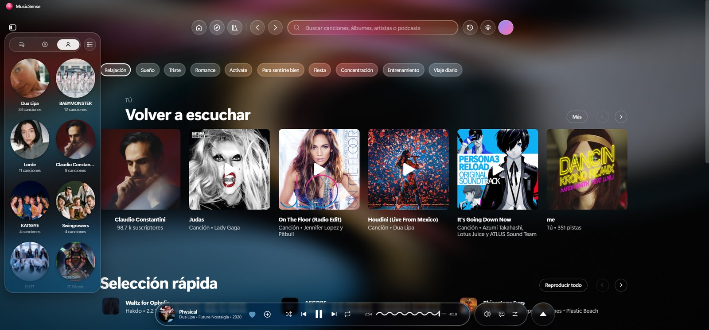
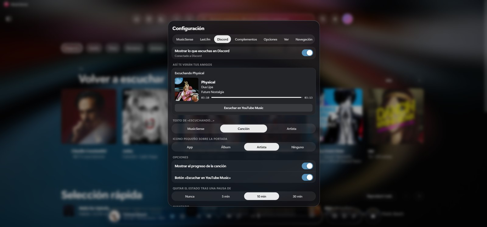

<div align="center">



# MusicSense

**YouTube Music en tu escritorio, con el estilo de Apple Music.**
Vidrio translúcido, letras que brillan palabra por palabra, un visualizador que late con la música y audio con ecualizador, salas y sonido espacial.

[**Descargar para Windows**](https://github.com/bbernalm/MusicSense/releases/latest)



</div>

> [!IMPORTANT]
> Proyecto personal y no oficial. No está afiliado, autorizado ni respaldado por Google LLC ni por YouTube. "YouTube" y "YouTube Music" son marcas de Google LLC.

## Lo más destacado

### Letras como en Apple Music

Letra sincronizada, grande y centrada en la canción. Cada palabra se ilumina justo cuando se canta, sube un poco y brilla en las notas largas. Debajo de cada línea aparece la traducción a tu idioma.



### Sonido a tu gusto, sin salir del reproductor

El botón de ajustes rápidos de la cápsula abre un panel de vidrio con todo el audio:

- **Ecualizador** de 10 bandas con modos (Más graves, Voz, Electrónica, Rock…).
- **Fundido** entre canciones.
- **Audio espacial** para auriculares y **estéreo amplio**.
- **Salas** de reverberación: estudio, sala y auditorio.
- Estilo del fondo, de la barra de progreso y traducción de letras.



### Tu biblioteca a un clic

Menú lateral flotante con tus playlists, álbumes y artistas, en lista o en **cuadrícula de portadas grandes**. Barra superior con Inicio, Explorar y Biblioteca, buscador en píldora y el historial.



### Discord y Last.fm integrados

- **Estado de Discord** con la portada, el progreso de la canción y un botón para escucharla. Tú eliges el texto de "Escuchando…" y el icono pequeño, con vista previa en vivo.
- **Last.fm**: conecta tu cuenta autorizando la app o con usuario y contraseña, y registra lo que escuchas (scrobbling).



## Todas las funciones

- **Diseño "liquid glass"** inspirado en iOS 26: vidrio con refracción y aberración cromática en los bordes.
- **Fondo líquido** con los colores de la portada, en movimiento.
- **Portadas animadas** de Apple Music cuando la canción las tiene.
- **Visualizador en la portada**: ondas de luz que salen de sus bordes y la portada late con los graves.
- **Barra de progreso** precisa y fluida, con cuatro estilos: onda, onda con bolita, línea y línea con bolita.
- **Preferir música**: los videoclips se escuchan como canción y se ve la portada.
- **Arranque en pausa**: al abrir la app vuelve tu última canción, en pausa.
- **Controles en la barra de tareas de Windows** (anterior, pausa, siguiente) y la canción en el título de la ventana.
- **Resumen mensual** estilo Wrapped y estadísticas de escucha en tu perfil.
- **Sin publicidad de Premium** ni ventanas raras: diálogos centrados y menús de vidrio.

## Descargar e instalar

En [Releases](https://github.com/bbernalm/MusicSense/releases/latest) hay dos opciones para Windows de 64 bits:

- **MusicSense-Setup.exe**: instalador (crea el acceso directo y te deja elegir la carpeta).
- **MusicSense-portable.exe**: se abre sin instalar nada.

El programa no lleva firma digital: si Windows muestra "Windows protegió su PC", pulsa **Más información → Ejecutar de todas formas**.

## Qué es

MusicSense es una versión modificada de [Pear Desktop](https://github.com/pear-devs/pear-desktop) (antes `th-ch/youtube-music`), un cliente de YouTube Music hecho con Electron y TypeScript. Todo el diseño y las funciones nuevas viven en el complemento [`src/plugins/liquid-glass/`](src/plugins/liquid-glass/), que siempre está activo.

## Desarrollo

Requisitos: Node.js 22 o superior y pnpm 11 o superior.

```bash
pnpm install --frozen-lockfile
pnpm dev
```

Comprobaciones:

```bash
pnpm typecheck
pnpm lint
pnpm format:check
```

Instalador de Windows (cierra antes la app de desarrollo):

```bash
pnpm dist:win
```

Para traer las novedades de Pear Desktop (remoto `upstream`, solo lectura):

```bash
git fetch upstream
git merge upstream/master
```

## Créditos y licencia

Basado en [Pear Desktop](https://github.com/pear-devs/pear-desktop) y el trabajo de sus colaboradores. Estilo de letras inspirado en [Better Lyrics](https://github.com/better-lyrics/better-lyrics); portadas animadas gracias a [Better Lyrics Shaders](https://github.com/better-lyrics/shaders); fondo líquido con [Kawarp](https://www.npmjs.com/package/@kawarp/core). Se distribuye bajo la licencia MIT; ver [`license`](license).
